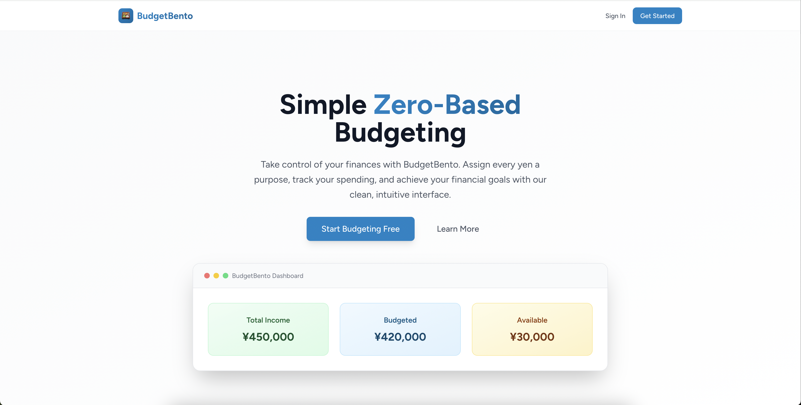
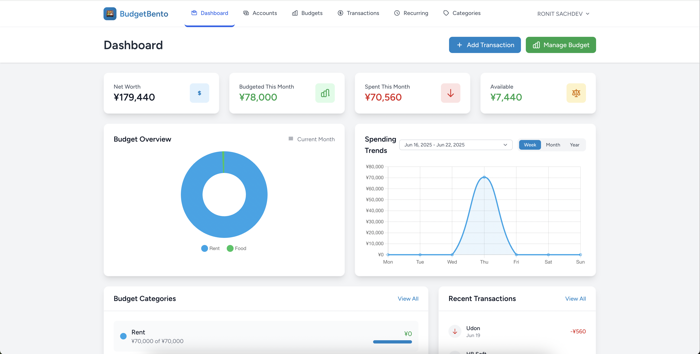
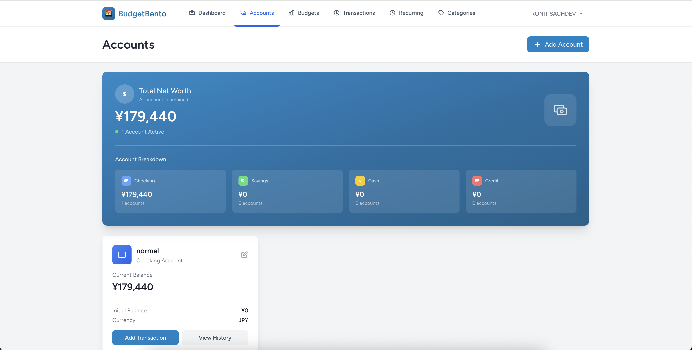
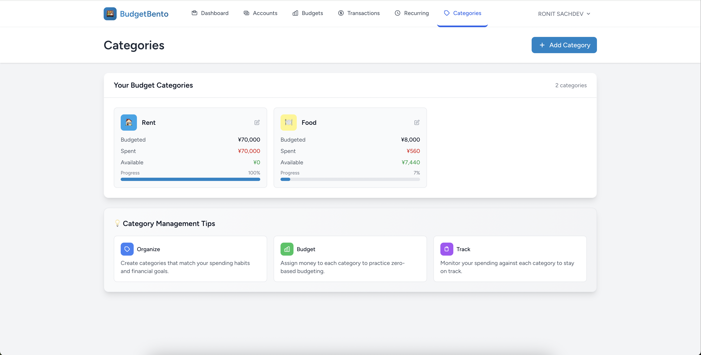
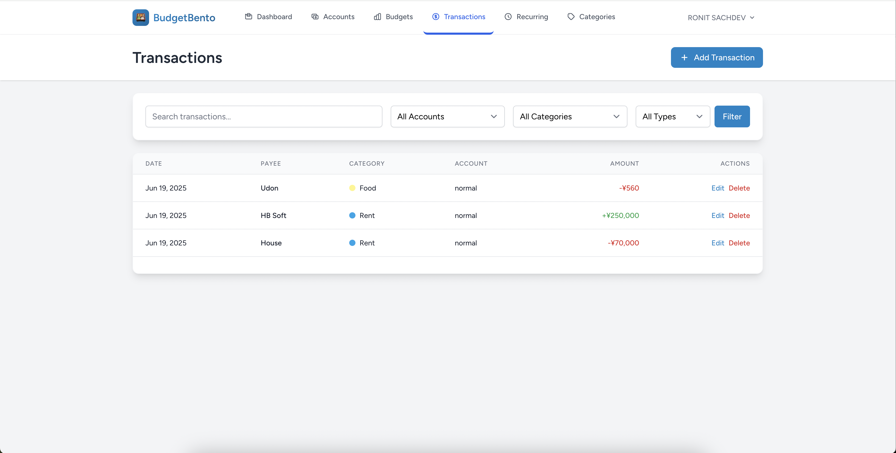

# 🍱 BudgetBento

> **Simple Zero-Based Budgeting Made Delicious**

A modern, intuitive budgeting application built with Laravel that helps users take control of their finances through zero-based budgeting methodology. Every yen gets assigned a purpose, ensuring complete financial awareness and control.

[](https://laravel.com)
[](https://php.net)
[](https://tailwindcss.com)
[](https://alpinejs.dev)

## 📱 Screenshots

### Landing Page
*Beautiful, minimal landing page showcasing the app's value proposition*



### Dashboard Overview
*Clean, modern dashboard showing financial summary, charts, and quick actions*



### Account Management
*Comprehensive account overview with balances and quick transaction options*



### Categories & Budget Tracking
*Smart category management with budget allocation and completion percentages*



### Transaction Management
*Detailed transaction tracking with filtering, search, and categorization*



## 🌟 Features

### **Core Budgeting**
- **Zero-Based Budgeting**: Assign every yen a purpose before spending
- **Monthly Budget Planning**: Set and track category-based budgets
- **Real-time Balance Tracking**: Instant updates across all accounts
- **Budget vs. Actual Analysis**: Visual comparison of planned vs. actual spending

### **Account Management**
- **Multiple Account Types**: Checking, Savings, Cash, Credit Cards
- **Account Balances**: Real-time balance tracking and updates
- **Transaction History**: Comprehensive transaction logging
- **Account Transfers**: Easy money movement between accounts

### **Smart Automation**
- **Recurring Transactions**: Automated income and expense processing
- **Flexible Scheduling**: Daily, weekly, monthly, yearly frequencies
- **Custom Intervals**: Every 2 weeks, every 3 months, etc.
- **Automatic Budget Updates**: Smart allocation of recurring transactions

### **Visual Analytics**
- **Interactive Charts**: Budget overview and spending trends
- **Period Comparisons**: Week, month, year view switching
- **Category Insights**: Detailed spending breakdown by category
- **Historical Analysis**: Track financial progress over time

### **User Experience**
- **Modern UI**: Clean, intuitive interface with Tailwind CSS
- **Responsive Design**: Perfect experience on desktop and mobile
- **Smart Categories**: Customizable categories with colors and icons
- **Setup Wizard**: Guided onboarding for new users

## Tech Stack

### **Backend**
- **Laravel 11.x** - Modern PHP framework with elegant syntax
- **PHP 8.2+** - Latest PHP features and performance improvements
- **SQLite** - Lightweight, serverless database for development
- **Laravel Breeze** - Simple authentication scaffolding

### **Frontend**
- **Blade Templates** - Laravel's powerful templating engine
- **Tailwind CSS 3.x** - Utility-first CSS framework
- **Alpine.js 3.x** - Lightweight JavaScript framework
- **Chart.js** - Beautiful, responsive charts and graphs

### **Development Tools**
- **Vite** - Fast build tool and development server
- **Composer** - PHP dependency management
- **NPM** - JavaScript package management
- **Artisan** - Laravel's command-line interface

## Getting Started

### Prerequisites
- PHP 8.2 or higher
- Composer
- Node.js & NPM
- SQLite (or MySQL/PostgreSQL)

### Installation

1. **Clone the repository**

2. **Install PHP dependencies**
   ```bash
   composer install
   ```

3. **Install JavaScript dependencies**
   ```bash
   npm install
   ```

4. **Environment setup**
   ```bash
   cp .env.example .env
   php artisan key:generate
   ```

5. **Database setup**
   ```bash
   touch database/database.sqlite
   php artisan migrate
   ```

6. **Build assets**
   ```bash
   npm run build
   ```

7. **Start the development server**
   ```bash
   php artisan serve
   ```

Visit `http://localhost:8000` to see BudgetBento in action!

## Architecture & Design Patterns

### **MVC Architecture**
- **Models**: Eloquent ORM for database interactions
- **Views**: Blade templates with component-based structure
- **Controllers**: RESTful controllers following Laravel conventions

### **Database Design**
- **Normalized Schema**: Efficient relational database structure
- **Foreign Key Constraints**: Data integrity and referential consistency
- **Migrations**: Version-controlled database schema changes

### **Security Features**
- **CSRF Protection**: Built-in Laravel CSRF token validation
- **User Authentication**: Secure login/registration with Laravel Breeze
- **Data Validation**: Server-side validation for all user inputs
- **Authorization**: User-specific data access controls

## Database Schema

### **Core Tables**
- `users` - User authentication and profile data
- `accounts` - Bank accounts, cash, credit cards
- `categories` - Spending categories with customization
- `budgets` - Monthly budget allocations per category
- `transactions` - All financial transactions
- `recurring_transactions` - Automated recurring entries

## Contributing

Contributions are welcome! Please feel free to submit a Pull Request. For major changes, please open an issue first to discuss what you would like to change.

1. Fork the project
2. Create your feature branch (`git checkout -b feature/AmazingFeature`)
3. Commit your changes (`git commit -m 'Add some AmazingFeature'`)
4. Push to the branch (`git push origin feature/AmazingFeature`)
5. Open a Pull Request

## License

This project is licensed under the MIT License - see the [LICENSE](LICENSE) file for details.

## Developer

**[Ronit Sachdev]**
- 🌐 Portfolio: [webronitsachdev.web.app](https://webronitsachdev.web.app)
- 📧 Email: ronitsachdev007@gmail.com
- 🐱 GitHub: [@RonitSachdev](https://github.com/RonitSachdev)

---

<div align="center">

**Built with ❤️ using Laravel & Modern Web Technologies**

*Making budgeting as organized and satisfying as a perfect bento box*

</div>
